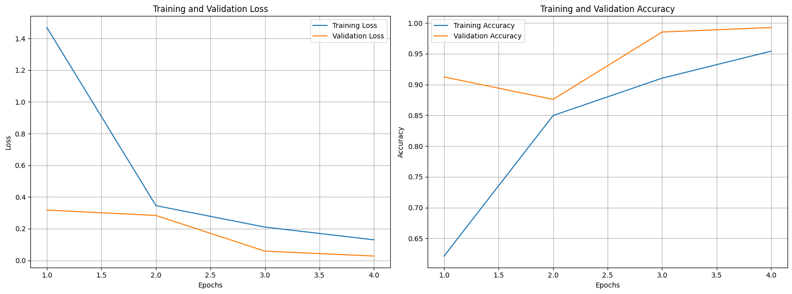

# Fake-Face-Detection-Model
## Model

This is a Machine Learning Model that uses Convolutional Neural Networks to detect between real images and fake images.

Real: The photo is actually taken and the person exists.

Fake: The person does not exist and the images are generated using the StyleGAN2, i.e., AI generated.

The is trained on the Train Dataset, and evaluated using Validation Dataset. The test Dataset is kept for the user to put and check.

## Dataset

The dataset can be found here: [click here for Google Drive link](https://drive.google.com/drive/folders/15QFBLT2GHWW1nDPj6KwgGiG6auOlZe7T?usp=drive_link).

It consists of closely 1200 real and fake images, with a uniform pixel dimensions of 300 x 300. 

It is divided into Train, Validation and Test Dataset in 90%-8%-2% (approx.) format.

Real:

Fake:

## Evaluation

The model has a  general final validation accuracy of 99% and validation loss of 0.03. 💪

